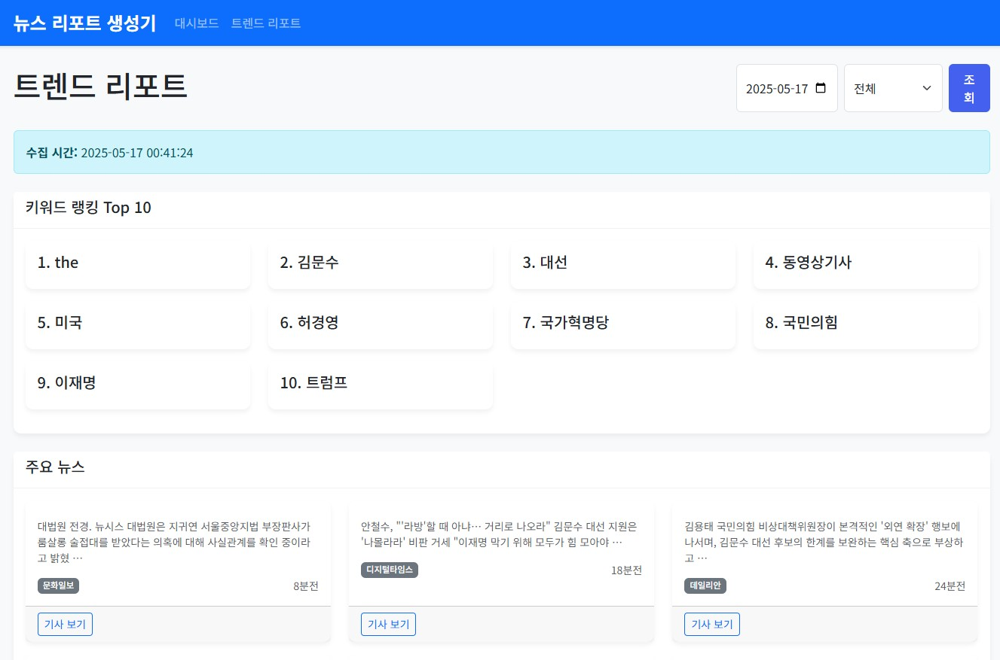

<div align="center">
  
</div>

# 뉴스 리포트 생성기

## 프로젝트 개요
네이버와 다음의 뉴스 트렌드를 분석하고 리포트를 자동으로 생성하는 웹 애플리케이션입니다. 다양한 소스에서 수집한 데이터를 기반으로 트렌드를 분석하고, 사용자에게 유용한 정보를 제공합니다.

## 주요 기능

### 데이터 수집
- 네이버 뉴스: 정치, 경제, 사회, 생활/문화, IT/과학, 세계 카테고리의 뉴스 크롤링
- 다음 뉴스: 사회, 정치, 경제, 국제, 문화, IT, 스포츠, 연예 카테고리의 뉴스 크롤링
- 네이버/다음 블로그: 트렌드 키워드 관련 블로그 포스트 크롤링

### 리포트 생성
- 일간 트렌드 리포트: 매일의 트렌드 키워드와 관련 뉴스 제공
- 경제 트렌드 리포트: 국내/세계 경제 관련 뉴스와 트렌드 키워드 제공

### 대시보드
- 트렌드 키워드 랭킹 제공
- 카테고리별 트렌드 요약
- 최근 뉴스 목록
- 경제 리포트 바로가기

## 설치 방법

### 요구사항
- Python 3.8 이상
- pip (Python 패키지 관리자)
- Git

### 설치 단계

1. 저장소 클론
```bash
git clone https://github.com/jinyounghwa/MarketingReport
cd MarketingReport
```

2. 가상환경 생성 및 활성화
```bash
python -m venv venv

# Linux/Mac
source venv/bin/activate

# Windows
venv\Scripts\activate
```

3. 의존성 설치
```bash
pip install -r requirements.txt
```

4. 애플리케이션 실행
```bash
python app.py
```

5. 웹 브라우저에서 접속
```bash
http://localhost:5000
```

## 사용법

### 데이터 수집
1. 웹 브라우저에서 `http://localhost:5000`에 접속합니다.
2. 대시보드에서 "데이터 수집" 버튼을 클릭합니다.
3. 원하는 카테고리와 키워드를 선택하고 "수집 시작" 버튼을 클릭합니다.
4. 수집이 완료되면 대시보드로 자동 이동합니다.

### 트렌드 리포트 보기
1. 대시보드에서 "일간 리포트" 버튼을 클릭합니다.
2. 원하는 날짜를 선택하고 조회 버튼을 클릭합니다.
3. 트렌드 키워드, 관련 뉴스, 블로그 포스트를 확인할 수 있습니다.

### 경제 트렌드 리포트 보기
1. 대시보드에서 "경제 리포트" 버튼을 클릭합니다.
2. "세계 경제 포함" 체크박스를 통해 국내 경제만 보거나 세계 경제도 함께 볼 수 있습니다.
3. 경제 관련 키워드, 뉴스, 블로그 포스트를 확인할 수 있습니다.

## 기능 개선 및 확장 계획

### 단기 계획
- 사용자 지정 키워드 추가 기능
- 리포트 PDF 다운로드 기능
- 차트 시각화 개선

### 중장기 계획
- 사용자 인증 및 권한 관리 시스템 구현
- 사용자별 리포트 저장 기능
- 소셜 미디어 플랫폼 확장 (Twitter, Instagram 등)
- 인공지능 기반 트렌드 분석 및 예측 기능

## 기여 방법
1. 이 저장소를 포크하세요.
2. 기능 개발 또는 버그 수정을 위한 브랜치를 생성하세요.
3. 변경사항을 커밋하세요.
4. Pull Request를 제출하세요.

## 문제 해결

### 알려진 문제
- 네이버/다음 웹사이트 구조 변경시 크롤러가 작동하지 않을 수 있습니다.
- 데이터 수집 중 네트워크 오류가 발생할 수 있습니다.

### 해결 방법
- 크롤러 오류: `src/crawlers` 디렉토리의 해당 크롤러 파일을 업데이트하세요.
- 네트워크 오류: 재시도하거나 데이터 수집 속도를 느리게 설정하세요.

## 사용 기술
- **백엔드**: Python 3.8, Flask 2.0
- **크롤링**: BeautifulSoup4, Requests
- **데이터 처리**: NumPy
- **프론트엔드**: HTML5, CSS3, JavaScript, Bootstrap 5.3
- **기타 라이브러리**: 
  - BeautifulSoup4: 웹 크롤링
  - Pandas: 데이터 처리
  

## 디렉토리 구조
```
MarketingReport/  # 프로젝트 루트 디렉토리
├── src/
│   ├── crawlers/     # 웹 크롤러 모듈
│   │   ├── __init__.py
│   │   ├── naver_news.py   # 네이버 뉴스 크롤러
│   │   ├── naver_blog.py   # 네이버 블로그 크롤러
│   │   ├── daum_news.py    # 다음 뉴스 크롤러
│   │   └── daum_blog.py    # 다음 블로그 크롤러
│   ├── models/       # 데이터 모델
│   │   ├── __init__.py
│   │   └── trend.py        # 트렌드 데이터 모델
│   ├── services/     # 비즈니스 로직
│   │   ├── __init__.py
│   │   └── trend_service.py # 트렌드 서비스 로직
│   ├── static/       # 정적 파일 (CSS, JS, 이미지)
│   │   ├── css/
│   │   │   └── style.css     # 스타일시트
│   │   └── js/
│   │       └── main.js        # 클라이언트 사이드 스크립트
│   ├── templates/    # HTML 템플릿
│   │   ├── base.html       # 기본 템플릿
│   │   ├── index.html      # 대시보드 템플릿
│   │   ├── daily.html      # 일간 리포트 템플릿
│   │   ├── economy.html    # 경제 리포트 템플릿
│   │   └── collect.html    # 데이터 수집 템플릿
│   └── utils/        # 유틸리티 함수
│       ├── __init__.py
│       └── text_utils.py   # 텍스트 처리 유틸리티
├── .env             # 환경 변수 (긴밀한 정보 저장)
├── .gitignore       # Git 무시 파일 목록
├── app.py           # 애플리케이션 진입점
├── requirements.txt # 의존성 목록
└── README.md        # 프로젝트 문서
```

## 라이선스
MIT License